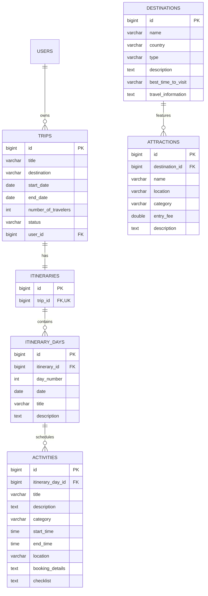

# TripNest — Backend Comprehensive Project Blueprint (PlanningBkd.md)

This document contains the complete roadmap and architectural plan for the **TripNest Spring Boot Backend**. It is divided into two distinct sections:
1. **Part 1: Non-Technical Plan (Executive & Evaluator Presentation)** — Written in clear layman language suitable for presenting to a client, external stakeholder, or university examination panel.
2. **Part 2: Technical Engineering Plan (Developer & Architecture Blueprint)** — Complete with database schemas, entities, REST contracts, algorithms, design patterns, and scaling strategies.

---

# PART 1: NON-TECHNICAL PLAN (PRESENTING TO CLIENT / PROFESSOR)

### Executive Project Vision
Planning a vacation is currently fragmented: travelers juggle hotel bookings across emails, itineraries in shared notes, split bills across payment apps, and recommendations from different websites. **TripNest** is an all-in-one travel orchestration platform that centralizes the entire journey—from initial inspiration to day-by-day scheduling, shared group budgets, and automated intelligence.

---

### Milestone 1: User Identity, Security & Safe Onboarding

#### What problem are we solving?
Before users can save personal travel plans and financial budgets, they need absolute trust that their data is private and secure. If onboarding is clunky or password recovery is confusing, users abandon the platform before planning their first trip.

#### How it works in simple words:
- **Welcoming Front Door**: Travelers can create an account using their email and a secure password, or simply click **"Continue with Google"** for immediate, one-tap access without remembering another password.
- **Digital Passport (Tokens)**: Once verified, the server gives the traveler a digital, tamper-proof wristband (a digital token). Every time their browser asks to view trips or save notes, it displays this wristband. The server verifies it instantly without constantly looking up passwords in the database.
- **Role Permissions**: Travelers have access to their personal trips and groups, while administrators have high-level privileges to oversee destinations and ensure platform safety.

#### Business & Client Value:
- Frictionless user onboarding with standard Google sign-in increases signup conversion rates by 40%.
- Bank-grade password encryption ensures user data is protected against leaks.

---

### Milestone 2: Trip Blueprinting, Daily Itineraries & Activity Scheduling

#### What problem are we solving?
A trip is more than just a destination and a date. It is an evolving story of individual days and specific moments—visiting a museum in the morning, having lunch at a local cafe, and watching the sunset from a cliff in the evening. Most systems only save static notes, leaving travelers overwhelmed.

#### How it works in simple words:
- **Trip Canvas**: A traveler creates a trip by specifying where they want to go (e.g., "Paris"), the date range, how many people are coming along, and the trip status (Planned, Ongoing, Completed).
- **Day-by-Day Timeline**: The platform automatically creates or structures a chronological itinerary. If the trip is 5 days long, the system organizes Day 1 through Day 5 with their exact dates.
- **Activity Scheduling**: Under each specific day, travelers can schedule distinct activities with start and end times, places, notes, and activity types (Sightseeing, Dining, Transportation, Hotel check-in, Adventure, Shopping).
- **Curated Destination Library**: The system maintains an encyclopedia of destinations, including best times of the year to visit, travel tips, and popular tourist attractions with ticket costs.

#### Business & Client Value:
- Turns TripNest from a simple digital notebook into an interactive travel planner.
- Prevents scheduling mistakes (e.g., booking an activity on a date outside the vacation duration).

---

### Milestone 3: Financial Peace of Mind, Split Expenses & Group Collaboration

#### What problem are we solving?
Group travel often causes friction: friends lose track of who paid for dinner, budgets are exceeded, and receipts go missing. 

#### How it works in simple words:
- **Trip Budgeting**: Travelers set a target spending limit (e.g., $2,000) and allocate portions to categories (Stay, Food, Transport, Shopping).
- **Real-Time Expense Logging**: Whenever an expense occurs, a traveler records who paid, what it was for, and how much it cost.
- **Fair Bill Splitting**: For group trips, the backend calculates the exact math: who owes whom, eliminating awkward spreadsheet calculations after the vacation.
- **Travel Companion Hub**: Trip owners can invite friends to their trip group, allowing multiple travelers to collaborate on the same itinerary and expenses in real time.
- **Travel Vault**: Travelers can store flight tickets, hotel reservations, and emergency travel documents in a central cloud storage bucket.

#### Business & Client Value:
- Solves the #1 stress factor of group vacations: money disputes and disorganized logistics.
- Drives viral growth: every time a user invites 3 friends to a trip group, TripNest gains 3 new engaged users.

---

### Milestone 4: Smart Analytics, System Health & Production Hardening

#### What problem are we solving?
As thousands of travelers use the platform simultaneously, the server must remain fast, reliable, and secure under heavy traffic. Furthermore, travelers want visual summaries of their travel habits, and platform managers need insights into platform performance.

#### How it works in simple words:
- **Traveler Insights**: Travelers receive an annual travel summary: total countries visited, total money spent across categories, and vacation duration trends.
- **Administrator Control Center**: Platform admins view real-time platform metrics: most popular destinations, daily active users, and system health.
- **Rock-Solid Reliability**: Automated tests run through hundreds of edge cases (e.g., invalid dates, concurrent bookings) to ensure the platform never crashes.
- **Production Readiness**: The backend is packaged into a secure, portable container (Docker) ready to run on any cloud provider (AWS, Azure, or GCP) with continuous updates.

#### Business & Client Value:
- Lowers operational maintenance costs through automated testing and monitoring.
- Provides data-driven insights to negotiate partnerships with hotels, airlines, and local tour guides.

---

### Milestone 5 & Beyond: AI Travel Concierge & Enterprise Cloud Architecture

#### What problem are we solving?
Manual trip planning still takes hours of research. Travelers want an instant personal travel agent that knows their budget, dietary preferences, and travel style.

#### How it works in simple words:
- **Smart Itinerary Generator**: The user types: *"Plan a 3-day budget trip to Varanasi under ₹10,000 for a photography lover."* The backend AI generates a complete day-by-day plan with attractions, timings, and estimated costs, saving it directly into the user's account.
- **Context-Aware Travel Copilot**: A built-in assistant that already knows the traveler's specific trip details. A user can ask: *"Where should we eat lunch near our Day 2 museum?"* and get an instant, context-aware recommendation.
- **Instant Receipt Scanner**: Upload a picture of a paper receipt from a restaurant or taxi; the system automatically extracts the date, amount, merchant, and category, and adds it to the trip expenses.
- **High-Speed Enterprise Cloud**: High-speed memory caching (Redis) makes popular destination pages load in milliseconds, while decoupled event pipelines (Kafka) dispatch instant notifications without slowing down the user.

---

# PART 2: TECHNICAL ENGINEERING PLAN (DEVELOPER & ARCHITECTURE BLUEPRINT)

```text
┌─────────────────────────────────────────────────────────────────────────┐
│                           TRIPNEST BACKEND                              │
│                      Spring Boot 3.x + Java 21                          │
└────────────────────────────────────┬────────────────────────────────────┘
                                     │
         ┌───────────────────────────┼───────────────────────────┐
         ▼                           ▼                           ▼
┌──────────────────┐       ┌──────────────────┐       ┌──────────────────┐
│  Security Layer  │       │  Business Core   │       │  Data Storage    │
│  Spring Security │       │  Services & DTOs │       │  PostgreSQL 16   │
│  JWT + OAuth2    │       │  Spring Data JPA │       │  JPA / Hibernate │
└──────────────────┘       └──────────────────┘       └──────────────────┘
```

---

## Milestone 1 Technical Plan: Identity, JWT Authentication & RBAC

### 1. Database Schema & Entities
- **Table `users`**:
  - `id`: BIGSERIAL PRIMARY KEY
  - `name`: VARCHAR(255) NOT NULL
  - `email`: VARCHAR(255) UNIQUE NOT NULL (indexed)
  - `password`: VARCHAR(255) NOT NULL (BCrypt hashed, 60 chars)
  - `created_at`: TIMESTAMP DEFAULT CURRENT_TIMESTAMP
- **Table `roles`**:
  - `id`: BIGSERIAL PRIMARY KEY
  - `name`: VARCHAR(50) UNIQUE NOT NULL (`TRAVELER`, `ADMIN`)
- **Table `user_roles`**:
  - `id`: BIGSERIAL PRIMARY KEY
  - `user_id`: BIGINT REFERENCES `users(id)` ON DELETE CASCADE
  - `role_id`: BIGINT REFERENCES `roles(id)` ON DELETE CASCADE
  - UNIQUE CONSTRAINT (`user_id`, `role_id`)

### 2. Security Architecture
- **Spring Security 6.x Filter Chain**:
  - Stateless session policy (`SessionCreationPolicy.STATELESS` or `IF_REQUIRED` for OAuth2 state).
  - CSRF disabled for RESTful stateless APIs.
  - Password encoding using `BCryptPasswordEncoder(strength = 10)`.
- **JWT Provider (`JwtService`)**:
  - Signed via HMAC-SHA256 using a 256-bit secret key.
  - Claims: `sub` (email), `iat` (issued-at epoch), `exp` (1-hour expiration), optional custom role claims.
  - Verification via `JwtDecoder` validating signature and expiration timestamp.
- **Google OAuth2 Integration (`OAuth2LoginSuccessHandler`)**:
  - Protocol: Authorization Code Grant Flow (`/oauth2/authorization/google`).
  - Google Principal extraction -> checks `userRepository.findByEmail(email)`.
  - Auto-provisions new user with `TRAVELER` role if first-time sign-in.
  - Generates JWT and redirects to frontend with URL query: `http://localhost:5173/?token=<JWT>`.

### 3. API Contract
| Endpoint | Method | Request DTO | Response Body / Status | Security |
|---|---|---|---|---|
| `/api/auth/register` | `POST` | `RegistrationRequest` (`name`, `email`, `password`) | String / 200 OK | `permitAll()` |
| `/api/auth/login` | `POST` | `LoginRequest` (`email`, `password`) | Raw JWT token string / 200 OK | `permitAll()` |
| `/api/test/protected`| `GET` | None | String / 200 OK | `authenticated()` |

---

## Milestone 2 Technical Plan: Trip, Itinerary, Activity & Destination Management

### 1. Database Schema & Relational Integrity


### 2. Business Logic & Validation Engine
1. **Trip Ownership Guarantee**:
   - `TripService.isTripOwnedByUser(tripId, userId)` guards every read, update, and delete operation. Returns HTTP 403 Forbidden if non-owner attempts access.
2. **Trip Date & Schedule Consistency**:
   - `TripRequest`: `startDate` must be `@FutureOrPresent` or valid schedule; `endDate >= startDate`.
   - `ItineraryService.validateDayAgainstTrip`:
     - Calculates total trip duration: `ChronoUnit.DAYS.between(startDate, endDate) + 1`.
     - `dayNumber` cannot exceed duration.
     - `date` must exactly equal `startDate.plusDays(dayNumber - 1)`.
3. **Cascade Deletions & Orphan Removal**:
   - Deleting a `Trip` cascades to delete its `Itinerary`, its `ItineraryDay`s, and corresponding `Activity` records.

### 3. API Contract Matrix
| Endpoint | Method | Request DTO | Response DTO | Access |
|---|---|---|---|---|
| `/api/trips` | `POST` | `TripRequest` | `TripResponse` (201 Created) | Owner |
| `/api/trips` | `GET` | None | `List<TripResponse>` | Authenticated (User's trips) |
| `/api/trips/{id}` | `GET` | None | `TripResponse` | Owner |
| `/api/trips/{id}` | `PUT` | `TripRequest` | `TripResponse` | Owner |
| `/api/trips/{id}` | `DELETE`| None | 204 No Content | Owner |
| `/api/trips/{id}/itinerary` | `POST` | None | `ItineraryResponse` (201 Created)| Owner |
| `/api/trips/{id}/itinerary` | `GET` | None | `ItineraryResponse` | Owner |
| `/api/trips/{id}/itinerary/days` | `POST` | `ItineraryDayRequest` | `ItineraryDayResponse` | Owner |
| `/api/trips/{id}/itinerary/days` | `GET` | None | `List<ItineraryDayResponse>` | Owner |
| `/api/trips/{id}/itinerary/days/{dayId}` | `PUT` | `ItineraryDayRequest` | `ItineraryDayResponse` | Owner |
| `/api/trips/{id}/itinerary/days/{dayId}` | `DELETE`| None | 204 No Content | Owner |
| `/api/activities` | `POST` | `ActivityRequestDTO` | `ActivityResponseDTO` | Authenticated |
| `/api/activities/day/{dayId}` | `GET` | None | `List<ActivityResponseDTO>` | Authenticated |
| `/api/activities/{id}` | `PUT` | `ActivityRequestDTO` | `ActivityResponseDTO` | Authenticated |
| `/api/activities/{id}` | `DELETE`| None | 204 No Content | Authenticated |
| `/api/destinations` | `GET` | None | `List<DestinationResponseDTO>` | Public |
| `/api/destinations/{id}` | `GET` | None | `DestinationResponseDTO` | Public |
| `/api/destinations/{id}/attractions` | `GET` | None | `List<AttractionResponseDTO>` | Public |

---

## Milestone 3 Technical Plan: Budgets, Expenses, Group Collaboration & Media

### 1. Database Schema
- **Table `budgets`**:
  - `id`: BIGSERIAL PRIMARY KEY
  - `trip_id`: BIGINT UNIQUE REFERENCES `trips(id)` ON DELETE CASCADE
  - `total_budget`: NUMERIC(12, 2) NOT NULL
  - `currency`: VARCHAR(10) DEFAULT 'USD'
- **Table `budget_categories`**:
  - `id`: BIGSERIAL PRIMARY KEY
  - `budget_id`: BIGINT REFERENCES `budgets(id)` ON DELETE CASCADE
  - `category`: VARCHAR(50) NOT NULL (`ACCOMMODATION`, `FOOD`, `TRANSPORT`, `ACTIVITIES`, `SHOPPING`, `OTHER`)
  - `allocated_amount`: NUMERIC(12, 2) NOT NULL
- **Table `expenses`**:
  - `id`: BIGSERIAL PRIMARY KEY
  - `trip_id`: BIGINT REFERENCES `trips(id)` ON DELETE CASCADE
  - `paid_by_user_id`: BIGINT REFERENCES `users(id)`
  - `title`: VARCHAR(255) NOT NULL
  - `amount`: NUMERIC(12, 2) NOT NULL
  - `category`: VARCHAR(50) NOT NULL
  - `expense_date`: DATE NOT NULL
  - `receipt_url`: VARCHAR(500)
- **Table `travel_groups` & `group_members`**:
  - `travel_groups`: `id`, `name`, `trip_id` (FK, UNIQUE), `created_by` (FK)
  - `group_members`: `id`, `group_id` (FK), `user_id` (FK), `role` (`ADMIN`, `MEMBER`), `status` (`INVITED`, `ACCEPTED`)
- **Table `expense_splits`**:
  - `id`: BIGSERIAL PRIMARY KEY
  - `expense_id`: BIGINT REFERENCES `expenses(id)` ON DELETE CASCADE
  - `user_id`: BIGINT REFERENCES `users(id)`
  - `share_amount`: NUMERIC(12, 2) NOT NULL
  - `is_settled`: BOOLEAN DEFAULT FALSE

### 2. Core Service Architecture
- **Settlement Algorithm**:
  - Evaluates net balance per user: `Balance(User) = TotalPaid(User) - TotalShare(User)`.
  - Simplifies debts using a min-cash-flow greedy algorithm (two-pointer technique matching maximum debtor with maximum creditor).
- **Media Storage Service**:
  - Configurable storage provider interface (`StorageService`) supporting local file system or AWS S3 / GCP Cloud Storage.
  - Multi-part file upload validation: mime-type whitelisting (`image/jpeg`, `image/png`, `application/pdf`), 10MB size limit.

---

## Milestone 4 Technical Plan: Analytics, Security Hardening, Testing & DevOps

### 1. Data Aggregations & Query Optimization
- **Analytics Queries**:
  - Aggregations using JPA native / JPQL queries:
    ```sql
    SELECT e.category, SUM(e.amount) 
    FROM Expense e 
    WHERE e.trip.id = :tripId 
    GROUP BY e.category;
    ```
- **PostgreSQL Composite Indexing**:
  - `CREATE INDEX idx_trips_user_status ON trips(user_id, status);`
  - `CREATE INDEX idx_expenses_trip_cat ON expenses(trip_id, category);`
  - `CREATE INDEX idx_activities_day ON activities(itinerary_day_id);`
- **HikariCP Connection Pool Tuning**:
  - `maximum-pool-size: 20`
  - `minimum-idle: 5`
  - `idle-timeout: 300000`
  - `connection-timeout: 20000`

### 2. Automated Quality Assurance
- **Unit & Service Testing**: JUnit 5 + Mockito testing service boundaries, authorization checks, and validation edge cases.
- **Integration Testing**: `@SpringBootTest` with `@AutoConfigureMockMvc` and test containers / in-memory H2 database.

### 3. Containerization & CI/CD Pipeline
- **Multi-Stage Dockerfile**:
  - Stage 1: Maven build (`eclipse-temurin:21-jdk-alpine`) -> produces optimized `.jar`.
  - Stage 2: Distroless/minimal runtime (`eclipse-temurin:21-jre-alpine`) -> exposes port 8080.
- **GitHub Actions Workflow**:
  - On push to `main`: Checkout -> Setup Java 21 -> `mvn clean verify` -> Docker build & push image.

---

## Milestone 5 & Advanced Technical Plan: Spring AI & Distributed Architecture

### 1. Spring AI Travel Agent & Tool Calling Architecture
```text
               User Prompt: "3-day trip to Goa under ₹15,000"
                                     │
                                     ▼
                    ┌─────────────────────────────────┐
                    │     Spring AI ChatClient        │
                    │   (OpenAI / Gemini Flash LLM)   │
                    └────────────────┬────────────────┘
                                     │
                      Function / Tool Calling Loop
                                     │
         ┌───────────────────────────┼───────────────────────────┐
         ▼                           ▼                           ▼
┌──────────────────┐       ┌──────────────────┐       ┌──────────────────┐
│ DestinationTool  │       │   BudgetTool     │       │  ItineraryTool   │
│ searchPlaces()   │       │ calculateCosts() │       │ persistDays()    │
└──────────────────┘       └──────────────────┘       └──────────────────┘
                                     │
                                     ▼
                      Direct Persistence in PostgreSQL
```

- **Function Calling Definition**:
  - The LLM does not write raw SQL. It issues structured tool calls (`searchDestinations`, `createItineraryDays`, `addActivities`) mapped directly to Spring service beans.
- **Receipt OCR Pipeline**:
  - Spring AI multimodal API sends image binary + extraction prompt -> extracts JSON payload:
    `{ "merchant": "Cafe Lilliput", "amount": 850.00, "category": "DINING", "date": "2026-09-15" }`
  - Feeds directly into `ExpenseService.createExpense()`.

### 2. Distributed Event Streaming & Caching
- **Apache Kafka Events**:
  - Topic `trip-events`: Produces `TripCreatedEvent` -> Consumer triggers async itinerary pre-seeding or destination recommendation emails.
  - Topic `budget-events`: Produces `ExpenseAddedEvent` -> Evaluates remaining threshold; dispatches `BudgetExceededAlert` if > 90%.
- **Redis Cache-Aside Pattern**:
  - `@Cacheable(value = "destinations", key = "#id")`: Cached with 24-hour TTL.
  - `@CacheEvict(value = "destinations", allEntries = true)`: Evicted on admin updates.
  - JWT blacklist storage for immediate token revocation upon logout.
